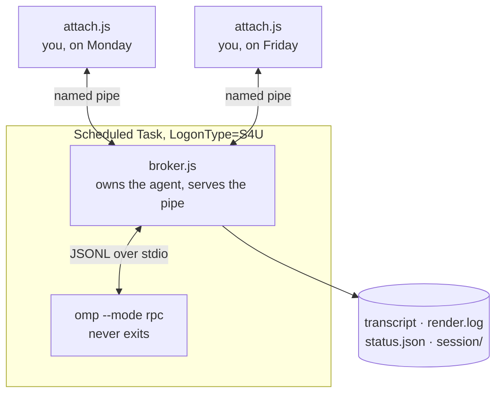

# ompjob

**Detached, reboot-surviving, *interactive* AI agent sessions on a Windows machine.**

Start an [omp](https://github.com/possibilities/oh-my-pi) agent over SSH, close
your laptop, fly somewhere, reconnect days later, and **continue the same
conversation** — history intact, agent still working.

```powershell
ssh myhost
ompjob start refactor -Prompt "Migrate the auth module to JWT" -Attach
# ...talk to it, Ctrl+D to detach, close the terminal, shut down your laptop

# next week, from anywhere:
ssh myhost
ompjob attach refactor      # full history replays, then live -- keep talking
```

> [!IMPORTANT]
> **Requirements: Windows 10/11 only · PowerShell 5.1+ · Administrator ·
> Node 18+ · [`omp`](https://github.com/possibilities/oh-my-pi) installed and
> authenticated.**
>
> `ompjob` is a *supervisor, not an agent*. It does nothing without `omp`.
> It uses Windows named pipes and Windows Scheduled Tasks, so there is no
> macOS or Linux version.

> [!WARNING]
> Jobs run with **full administrator rights and tool approval disabled**.
> Read [SECURITY.md](SECURITY.md) before installing.

---

## The problem it solves

You SSH into a machine and start a long agent task. Then you close the terminal
— and it dies. On Linux you would reach for `tmux`. On Windows there is no
equivalent that works: your agent is a native Win32 process, so a Linux
multiplexer inside WSL cannot truly supervise it, and the WSL VM is torn down
after ~60s of inactivity or on any `wsl --shutdown`.

`ompjob` solves it with the mechanism Windows actually provides.



The **Scheduled Task** is what survives: `LogonType=S4U` runs whether or not
anyone is logged on, needs no stored password, and an `AtStartup` trigger brings
jobs back after a reboot. The **named pipe** is what makes it interactive: the
agent's lifetime is decoupled from any client's, so you attach and detach as
often as you like.

## What survives what

| Event | Survives | Why |
|---|---|---|
| Closing your terminal | Yes | The task is owned by the scheduler, not your SSH session |
| Killing the SSH connection | Yes | Same |
| Shutting down your *local* machine | Yes | Nothing local is in the execution path |
| Logging off the remote machine | Yes | S4U runs without an interactive logon |
| Rebooting the remote machine | Yes | `AtStartup` trigger + `omp -c` resumes the session |
| Long runtime | Yes | `ExecutionTimeLimit = 0` disables the scheduler's 72-hour kill |
| Laptop on battery | Yes | `-AllowStartIfOnBatteries -DontStopIfGoingOnBatteries` |

## Install

```powershell
git clone https://github.com/AdityaIndoori/ompjob.git
cd ompjob
.\install.ps1              # adds an `ompjob` function to your $PROFILE
. $PROFILE                 # reload (or open a new shell)
ompjob list                # should print "no jobs"
```

The shim points at your clone, so `git pull` updates the tool in place.

Job state lives in `C:\ompjob` by default. Relocate it with an environment
variable if you prefer another drive:

```powershell
[Environment]::SetEnvironmentVariable('OMPJOB_ROOT', 'D:\ompjob', 'User')
```

## Your first job

```powershell
cd C:\some\project
ompjob start hello -Prompt "List the files here and tell me what this project is" -Attach
```

You are now attached. Type to talk. Then:

| Key | Effect |
|---|---|
| `Ctrl+D` | **Detach** — the job keeps running |
| `Ctrl+C` | **Interrupt the agent's turn** — does *not* kill the job |
| `/status` | Current state |
| `/abort` | Interrupt the current turn |
| `/stop` | Shut the job down |
| `/detach` | Same as `Ctrl+D` |

Anything else you type goes to the agent. **If the agent is mid-task your
message steers it immediately** — you do not have to wait for it to finish.

## Prove it really is detached

Do not take the claim on faith. Verify it:

```powershell
# 1. start something slow
ompjob start proof -Prompt "Run bash 'sleep 120', then reply DONE"

# 2. hard-kill the connection from your LOCAL machine (not a clean logout)
#    Windows:  taskkill /F /IM ssh.exe
#    macOS/Linux: pkill -9 ssh

# 3. reconnect and look
ssh myhost
ompjob status proof
```

Expected: `state waiting` or `thinking`, `broker live`, and `attached 0
client(s)` — the agent is alive with nobody connected.

## Commands

| Command | What it does |
|---|---|
| `ompjob start <name>` | Create and launch a job. See flags below. |
| `ompjob attach <name>` | Replay the conversation, then stream live and let you type. |
| `ompjob say <name> <text>` | Send one message without attaching. |
| `ompjob revive <name>` | Restart an `interrupted` job, **resuming** its session. |
| `ompjob list` | All jobs with state, turn count, attached clients. |
| `ompjob status <name>` | Detail for one job, including the agent's last line. |
| `ompjob logs <name>` | Formatted transcript. `-Tail <n>`, `-Follow`. |
| `ompjob stop <name>` | Shut the job down; keeps the transcript. |
| `ompjob rm <name>` | Delete the job, its task, and its run directory. |

### `start` flags

| Flag | Meaning |
|---|---|
| `-Prompt <text>` | Opening message. |
| `-PromptFile <path>` | Read the opening message from a file. |
| `-Cwd <dir>` | Working directory for the agent. Defaults to your current directory. |
| `-Model <name>` | Passed through to `omp --model`. |
| `-Attach` | Drop straight into the session after starting. |
| `-Force` | Recreate a job that already exists (**deletes its transcript**). |

## Job states and recovery

| State | Meaning | What to do |
|---|---|---|
| `starting` | Task launched, broker not yet serving | Wait a few seconds |
| `thinking` | Agent is working | `attach` and watch, or steer it |
| `waiting` | Agent is idle, ready for input | `attach` or `say` |
| `interrupted` | Broker died without a clean exit (hard kill, power loss) | **`ompjob revive <name>`** — resumes the session |
| `finished` | Job exited cleanly | `logs` to read it, `rm` to clean up |
| `registered` | Task exists but has never run | `ompjob revive <name>` |

`interrupted` jobs are also revived automatically at next boot. If you do not
want that, `ompjob rm <name>`.

## What "interactive" means here

You steer the agent. **The agent never asks you questions** — `omp`'s `ask`
tool does not exist in RPC mode, so a job can never block waiting for a human.
That is deliberate: an unattended job that stops for input would hang forever.

Practically: send corrections whenever you like, and they land mid-task.

## Troubleshooting

**`started '<job>' but the broker pipe has not appeared yet`**
`omp` is missing, not on `PATH`, or not authenticated. Verify with
`omp -p "say OK"`. Then `ompjob logs <name>` and check `err.log` in the run
directory.

**Four `Missing closing '}'` errors from a `.ps1` you just edited**
You introduced a non-ASCII character. PowerShell 5.1 reads BOM-less UTF-8 as
Windows-1252, so an em-dash becomes `â€"` and that embedded quote terminates a
string. **Keep `.ps1` files pure ASCII.** Check before running:

```powershell
$e = $null
[System.Management.Automation.PSParser]::Tokenize((Get-Content .\ompjob.ps1 -Raw), [ref]$e)
$e   # must be empty
```

**`scp` fails with `dest open ... No such file or directory`**
Use `scp -O` when copying to a Windows host whose shell is PowerShell. The
modern SFTP protocol mishandles `D:`-style paths.

**`Register-ScheduledTask: No mapping between account names and security IDs`**
Your `$env:USERDOMAIN` does not resolve (common on Microsoft accounts and
workgroup machines). `ompjob` avoids this by resolving your SID at runtime — if
you see it, you are calling `Register-ScheduledTask` yourself somewhere.

**`ompjob attach` says there is no live broker**
Check `ompjob status <name>`. `interrupted` → `ompjob revive`. `finished` →
the job is over; read it with `ompjob logs`.

## How it works

`broker.js` spawns `omp --mode rpc` and speaks newline-delimited JSON to it over
stdio. It translates RPC frames into a render log and serves them to any client
on `\\.\pipe\ompjob-<name>`.

The interactivity primitive is omp's `steer` command: a message injected into a
*live streaming turn*. The broker routes automatically — `steer` while the agent
is working, `prompt` while it is idle — which is what makes typing at any moment
behave like an ordinary conversation.

Everything durable is on disk under the job root, so reattaching after a reboot
works: `transcript.jsonl` (every RPC frame), `render.log` (the replay backlog),
`status.json` (reconcilable state), `session/` (omp's own session, for `-c`).

## Files

| File | Role |
|---|---|
| `ompjob.ps1` | The CLI |
| `broker.js` | Long-lived supervisor; owns the agent, serves the pipe |
| `attach.js` | Terminal client |
| `_launch.ps1` | Thin wrapper the Scheduled Task executes |
| `install.ps1` | Adds the `ompjob` function to your `$PROFILE` |

## License

MIT — see [LICENSE](LICENSE).
