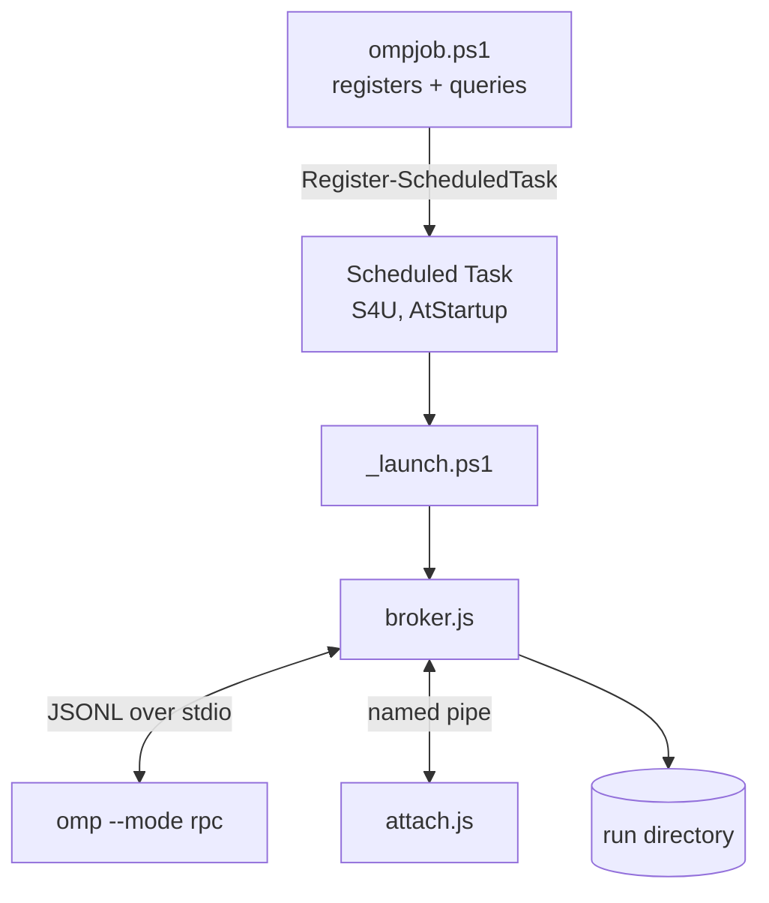

# Reference

Complete surface of the tool: commands, flags, states, files, and protocol.
Extracted from the source, not from memory.

---

## Command summary

| Command | Arguments | Purpose |
|---|---|---|
| `ompjob start` | `<name>` | Create and launch a job |
| `ompjob attach` | `<name>` | Interactive session: replay, then live |
| `ompjob say` | `<name> <text...>` | Send one message, no attach |
| `ompjob revive` | `<name>` | Restart an interrupted job, resuming its session |
| `ompjob list` | — | Table of every job |
| `ompjob status` | `<name>` | Detail for one job |
| `ompjob logs` | `<name>` | Formatted transcript |
| `ompjob stop` | `<name>` | Shut the agent down, keep the transcript |
| `ompjob rm` | `<name>` | Delete job, task, and run directory |

Running `ompjob` with no arguments is equivalent to `ompjob list`.

Job names must match `[A-Za-z0-9._-]+`. The name becomes a scheduled-task name
(`ompjob-<name>`) and a pipe name (`\\.\pipe\ompjob-<name>`), so it must be
unique on the machine.

## Flags

| Flag | Type | Used by | Meaning |
|---|---|---|---|
| `-Prompt` | string | `start` | Opening message |
| `-PromptFile` | path | `start` | Read the opening message from a file |
| `-Cwd` | path | `start` | Agent working directory. Defaults to your current directory |
| `-Model` | string | `start` | Passed to `omp --model` |
| `-Attach` | switch | `start` | Attach immediately after starting |
| `-Force` | switch | `start`, `rm` | `start`: recreate an existing job, **deleting its transcript**. `rm`: remove even while live |
| `-Tail` | int | `logs` | Lines to show. Default `40` |
| `-Follow` | switch | `logs` | Live tail |

`say` takes its message as trailing arguments, so quoting is optional for simple
text: `ompjob say build check the tests` works.

## Job states

Two vocabularies exist and both surface in the CLI. The **lifecycle** state comes
from reconciling the scheduler and the pipe; the **activity** state comes from the
broker.

| State | Source | Meaning | Action |
|---|---|---|---|
| `registered` | lifecycle | Task exists, has never run | `revive` |
| `starting` | broker | Broker up, agent not ready yet | Wait a few seconds |
| `thinking` | broker | Agent is mid-turn | `attach` to watch or steer |
| `waiting` | broker | Agent idle, ready for input | `attach` or `say` |
| `interrupted` | lifecycle | Broker died without a clean exit | **`revive`** |
| `finished` | lifecycle | Broker exited deliberately | `logs`, then `rm` |
| `unknown` | lifecycle | No such job | — |

### How liveness is determined

`status.json` alone is not trusted: a hard-killed broker leaves it saying
`waiting` forever. The pipe is ground truth for liveness, so the CLI reconciles:

| Pipe live | `done.json` exists | Reported |
|---|---|---|
| yes | — | whatever the broker last recorded |
| no | yes | `finished` |
| no | no | `interrupted` |

`done.json` is written **only** when the broker exits with code 0 *and* recorded
state `exited`. Any other ending stays revivable — that is what makes crash
recovery work, and why a killed job reports `interrupted` rather than `finished`.

## Interactive session keys

Inside `ompjob attach`:

| Input | Effect |
|---|---|
| any text | Sent to the agent (`steer` if a turn is live, `prompt` if idle) |
| `Ctrl+D` | Detach. Job keeps running |
| `Ctrl+C` | Interrupt the agent's current turn. Does **not** kill the job |
| `/detach`, `/exit` | Same as `Ctrl+D` |
| `/status` | Print current state |
| `/abort` | Interrupt the current turn |
| `/stop` | Shut the job down |

`attach.js` also accepts `--no-color`, and disables colour automatically when
stdout is not a TTY.

## Transcript event kinds

`ompjob logs` prints one labelled line per event:

| Kind | Meaning |
|---|---|
| `user` | A message you sent. Prefixed with `[username]` when it came from a client |
| `assistant` | Agent output |
| `tool` | A tool call the agent started |
| `tool-err` | A tool call that failed |
| `system` | Broker lifecycle: startup, resume, interrupt, shutdown |
| `error` | Delivery or RPC failure |

## Files on disk

Job root is `C:\ompjob` unless `OMPJOB_ROOT` is set. Each job owns
`<root>\runs\<name>\`:

| File | Contents |
|---|---|
| `meta.json` | Name, cwd, model, opening prompt, resume flag |
| `status.json` | Live state, turn count, attached clients, agent's last text |
| `render.log` | Human-readable transcript. **This is the backlog replayed on attach** |
| `transcript.jsonl` | Every raw RPC frame, for debugging |
| `inbox.jsonl` | Every message you sent, with timestamps |
| `err.log` | Broker and agent stderr |
| `done.json` | Written only on clean exit; makes the run terminal |
| `session/` | omp's own session directory, used by `-c` on revive |

> [!WARNING]
> `render.log`, `transcript.jsonl` and `inbox.jsonl` are **plaintext transcripts
> of your AI conversations**, including any code or secrets discussed. Treat the
> job root as secret material. The repository's `.gitignore` excludes all of
> them, in case you point `OMPJOB_ROOT` at a checkout.

## Environment variables

| Variable | Default | Purpose |
|---|---|---|
| `OMPJOB_ROOT` | `C:\ompjob` | Where job state lives |

Set it persistently:

```powershell
[Environment]::SetEnvironmentVariable('OMPJOB_ROOT', 'D:\ompjob', 'User')
```

## Architecture



### Why a Scheduled Task

`LogonType=S4U` is the only Windows mechanism that runs a process with no
interactive logon, no stored password, and no dependence on the session that
created it. Task settings that matter:

| Setting | Value | Why |
|---|---|---|
| `ExecutionTimeLimit` | `0` | Disables the scheduler's default 72-hour kill |
| `MultipleInstances` | `IgnoreNew` | A duplicate trigger cannot start a second broker |
| `AtStartup` trigger | set | Revives interrupted jobs after reboot |
| `AllowStartIfOnBatteries` | set | The scheduler will not suspend the job on battery |
| `RunLevel` | `Highest` | Elevated. See [Security](security.html) |

### Pipe protocol

Client to broker, one JSON object per line:

| Message | Effect |
|---|---|
| `{"type":"input","text":"...","who":"..."}` | Deliver a message to the agent |
| `{"type":"abort"}` | Interrupt the current turn |
| `{"type":"status"}` | Request a state frame |
| `{"type":"shutdown"}` | Shut the job down |

Broker to client:

| Frame | Meaning |
|---|---|
| `hello` | Job name, cwd, state, turns, backlog size |
| `render` | A transcript event (`kind` + `text`) |
| `live` | Backlog finished; everything after this is live |
| `delta` | Streaming token text |
| `state` | State or streaming change |

### Message routing

`prompt` is rejected by omp while a turn is streaming, and `steer` is meaningless
when it is idle, so the broker picks based on state — and, because that state can
lag right after a resume, retries the other form once if the first is rejected.
A message therefore cannot be silently lost to a race.

## Exit codes and errors

| Message | Cause |
|---|---|
| `node not found on PATH` | Node is not installed or not visible to the task |
| `name must be [A-Za-z0-9._-]+` | Invalid job name |
| `job '<n>' is already live` | Use `attach`, or `stop` first |
| `job '<n>' exists in state '<s>'` | Use `-Force` to recreate, or `rm` |
| `job '<n>' has no live broker` | `say` needs a running job; check `status` |
| `no transcript yet for '<n>'` | The broker has not written `render.log` yet |
| `revive did not bring up a broker` | See `err.log` in the run directory |
| `started ... but the broker pipe has not appeared yet` | Almost always `omp` missing or unauthenticated |

## Uninstall

```powershell
ompjob list                       # note the names
ompjob stop <name>; ompjob rm <name>    # for each

Get-ScheduledTask -TaskName 'ompjob-*'  # must return nothing
Remove-Item -Recurse C:\ompjob          # or your OMPJOB_ROOT
```

Then delete the `function ompjob` line from your PowerShell `$PROFILE`.
